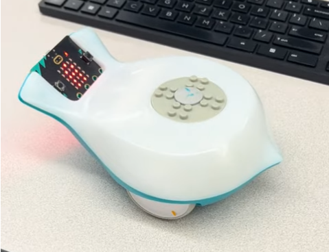

# Final Project: Finch Robot Challenges

## Essential Question
How can we apply object-oriented programming principles and Java concepts to create interactive, autonomous robot behaviors that solve real-world challenges?

## Project Overview
In this project-based learning experience, you will program a Finch 2.0 robot to perform one of three challenges:
1. Choreograph a dance routine (with movement, lights, and sound)
2. Create an artistic drawing using the robot's movements
3. Navigate a maze autonomously

Your program must demonstrate your understanding of Java programming concepts from APCSA and object-oriented design principles while creating an engaging robot behavior.

## Learning Objectives
- Apply Java programming concepts in a physical computing context
- Implement object-oriented design principles
- Develop problem-solving skills through algorithm development
- Create well-documented and maintainable code
- Practice technical communication through presentations and documentation

## Description of design choices
We chose to do dancing because it seemed fun and cooler. We also chose to make the lights write the name of the robot because it was fun to make and looked pretty.
## Challenges faced and solutions
Some challenges we faced were making the robot sing because we wanted to have a cool melody to go with the dancing, but it didn't work out very well. Neither of us are musically talented, so getting the robot to produce the right notes was very difficult. This is why we instead decided to do lights and dancing only.
  ## Future enhancements
Add music because it would be so fun and cool if it could sing a song while dancing. Also, we could find a more efficient and better way to code the dancing and lights of the robot so it isn't so repetitive and long.
  ## Video or images of your robot in action (embedded or linked)
 [] (https://youtube.com/shorts/oUwiU92BGtQ?feature=share)
